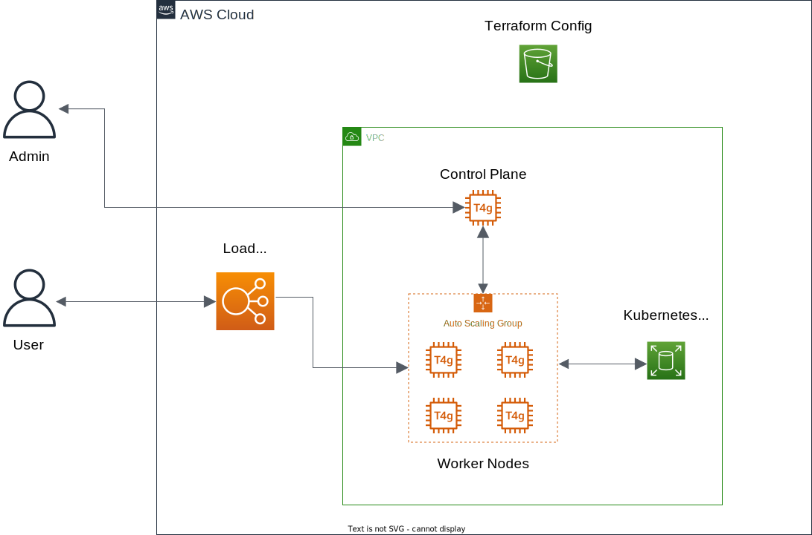

# Bachelor-Thesis about the AWS Graviton Chip (arm64)
Amazon is producing there own server Central Prosessing Units (CPU) - named Graviton - since 2017 in the commonly unknown subsidiary Annapurna Labs.
Main focus was to find out, how a modern project can be put together and where are still problems when using the ARM architecture on the server side.

# AWS Infrastructure

# Kubernetes Architecture

